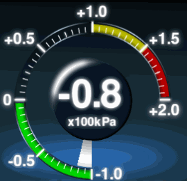
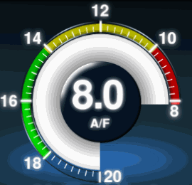
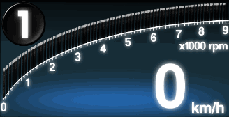

# Documentation of meter primitive parts classes.

## Table of contents
* [Introduction](#introduction)
* [Common properties and methods.](#commonProperties)
* [CircularProgressBar](#circularProgressBar)
* [RectangularProgressBar](#rectangularProgressBar)
* [RotationNeedleGauge](#rotationNeedleGauge)

## <a name="introduction">Introduction</a>
This library currently have 3 types of meter primitive parts.
Each parts extends the PIXI.Container parts, and can be treated like PIXI.Container.
To view the source code of meter primitives, refer [WebSocketGaugeClientNeo/src/lib/Graphics](../src/lib/Graphics).

### Setup options
Each meter primitive classes have "Option" class to describe the setting.
Before construct the parts instance (by `new` statement), it is better to describe the meter setting like this..
```js
// Create "Option" object and input the settings.
const waterTempProgressBarOptions = new CircularProgressBarOptions();
waterTempProgressBarOptions.Texture = PIXI.Texture.fromFrame("AnalogSpeedMeter_Bar");
waterTempProgressBarOptions.Max = 60;
waterTempProgressBarOptions.Min = 140;
waterTempProgressBarOptions.Radius = 162;
waterTempProgressBarOptions.InnerRadius = 120;
waterTempProgressBarOptions.OffsetAngle = 165;
waterTempProgressBarOptions.FullAngle = 120;
waterTempProgressBarOptions.Center.set(162,162);

// Create meter primitive(CircularProgressBar) object (by setting the option class as the argument of the constructor)
const waterTempProgressBar = new CircularProgressBar(waterTempProgressBarOptions);
```

After creating the primitive objects, the content of the "Option" objects can be accessed as `Options` property.
Thus, it is also possible to create primitive class with blank constructor argument, and input settings via Option property.
```js
//Create RectangularProgressBar with blank constructor argument.
const tachoProgressBar = new RectangularProgressBar();

//Input the settings via Options property.
tachoProgressBar.Options.Texture = PIXI.Texture.fromFrame("DigiTacho_Bar");
tachoProgressBar.Options.Min = 0;
tachoProgressBar.Options.Max = 9000;
tachoProgressBar.Options.Vertical = false;
tachoProgressBar.Options.InvertDirection = false;
tachoProgressBar.Options.GagueFullOnValueMin = false;
tachoProgressBar.Options.PixelStep = 8;
tachoProgressBar.Options.MaskHeight = 246;
tachoProgressBar.Options.MaskWidth = 577;
```

## <a name="commonProperties">Common properties (member of super class `Gauge1D` and `Gauge1DOptions`)</a>
All of meter primitives have some common properties and methods.
(Actually, all of the meter primitive extend the base class of `Gauge1D`).

### Class definition code
See [WebSocketGaugeClientNeo/src/lib/Graphics/private/GagueBase.ts](../src/lib/Graphics/private/GaugeBase.ts).

### Properties
* `Value` (:number)
	* The value of gauge.
	* **To update the view of gauge, (currently) the method of `update()` or `updateForce()` needs to be called after updating the `Value`.
	Please do not forget.**
* `Max` (:number)
* `Min` (:number)
	* Define the maximum and minimum of the gauges. It is possible to set the `Value` out of the range of Min to Max. In that case, gauge view stuck to Min or Max.
* `GagueFullOnValueMin` (:boolean)
	* This flag is set to false by default.
	* If this flag set to true, gauge filling(rotation or moving) direction is inverted. (Therefore, gauge is full when he `Value` equal to `Min`).
	
	
    
    (Left : GagueFullOnValueMin = **false**. Right : GagueFullOnValueMin = **true**.)

### Methods
* `update()`
	* Update the gauge viewing.
	* If the `Value` property is not changed from the previous call of `update()`, this function is exited with do nothing.
* `updateForce()`
	* Similar to `update()`, but this method update the gauge viewing even if the `Value` property is not change from the previous call.
	* If the gauge `Value` is not updated (fixed) after creation (such as red zone indicator), use this instead of `update()`.
		* (This 'value update check' feature aims to eliminate javascript calls to improve the performance. However, this might not be so effective. And might be eliminated in future version.)

## <a name="circularProgressBar">CircularProgressBar</a>
* `CircularProgressBar` defines the pie or doughnut shaped progress bar like gauge.

	

* The `CircularProgressBar` class create the "doughnut" or "pie" shaped mask, and clips the `Texture` with using this mask.

	

## Class definition code
See [WebSocketGaugeClientNeo/src/lib/Graphics/private/CircularProgressBar.ts](../src/lib/Graphics/private/CircularProgressBar.ts)

### Example code
```js
// Create Option class
const waterTempProgressBarOptions = new CircularProgressBarOptions();
// Assing Texture
waterTempProgressBarOptions.Texture = PIXI.Texture.fromFrame("AnalogSpeedMeter_Bar");
// Set the gauge range from 60(degC) to 140(degC)
waterTempProgressBarOptions.Max = 60;
waterTempProgressBarOptions.Min = 140;
// Set radius and inner radius of doughnut shaped mask.
waterTempProgressBarOptions.Radius = 162;
waterTempProgressBarOptions.InnerRadius = 120;
// Set "Offset" and "Full" angle (see the figure above).
waterTempProgressBarOptions.OffsetAngle = 165;
waterTempProgressBarOptions.FullAngle = 120;
// Set the center position of doughnut shaped mask.
waterTempProgressBarOptions.Center.set(162,162);

const waterTempProgressBar = new CircularProgressBar(waterTempProgressBarOptions);
```

### Properties
Following properties are available on `CircularProgressBarOptios` class.
* `Radius` (:number)
* `InnerRadius` (:number)
	* Radius and inner radius (in pixel) of "doughnut" shaped mask.
	* If the `InnerRadius` set to 0, the mask become "pie" shaped mask.
* `OffsetAngle` (:number)
	* Angle offset (in degree) of the gauge. Angle offset means the angle where `Value` equal to `Min`.
* `FullAngle` (:number)
	* Angle displacement(swing?) from the `OffsetAngle`, when the `Value` equal to `Max`.
* `AntiClockwise` (:boolean)
	* The direction of the filling of CircularProgressBar. Default is false.
	* If this flag set to true, the progress bar is filled in anticlockwise direction.
* `AngleStep` (:number)
	* The filling step of progress bar (in degree). For smooth animation this value should be set to small value (0.1 deg at default).
	* However, changing this to specified angle should be useful to make "LED type" gauge (see below).
	
	 
	
    (Left : `AngleStep` = **0.1**deg(default), Right: `AngleStep` = **6**deg)

## <a name="rectangularProgressBar">RectangularProgressBar</a>

* `RectangularProgressBar` defines the rectangle progress bar like gauge.

	

* The `RectangularProgressBar` class create the rectangle mask, and clips the `Texture` with using this mask.

	
    
## Class definition code
See [WebSocketGaugeClientNeo/src/lib/Graphics/private/RectangularProgressBar.ts](../src/lib/Graphics/private/RectangularProgressBar.ts)

## Example code
```js
//Create tacho(engine rev) progress bar
const tachoProgressBar = new RectangularProgressBar();

// Assign texture.
tachoProgressBar.Options.Texture = PIXI.Texture.fromFrame("DigiTachoBar");

// Set Max and Min (0rpm to 9000rpm)
tachoProgressBar.Options.Min = 0;
tachoProgressBar.Options.Max = 9000;

// This gauge sweeps horizontal and left to right (see above figure)
tachoProgressBar.Options.Vertical = false;
tachoProgressBar.Options.InvertDirection = false;
tachoProgressBar.Options.GagueFullOnValueMin = false;

// Set mask height and width
tachoProgressBar.Options.MaskHeight = 246;
tachoProgressBar.Options.MaskWidth = 577;
```

## Properties
* `MaskHeight` (:number)
* `MaskWidth` (:number)
	* Set the mask height and width.
* `Vertical` (:boolean) (default : false)
	* Set vertical sweep (true) or horizontal sweep (false).
	* When this flag is false (i.e. horizontal sweep), `MaskWidth` will be the mask width where `Value` = `Max`.
	* When thus flag is true (i.e. vertical sweep), `MaskHeight` wll be the mask height where `Value` = `Max`.
* `InvertDirection` (:boolean) (default : false)
	* This flag invert the sweep direction.
	* On `Vertical` = false
		* Sweep left -> right when `InvertDirection` = false.
		* Sweep right -> left when `InvertDirection` = true.
    * On `Vertical` = true
    	* Sweep down -> up when `InvertDirection` = false.
    	* Sweep up -> down when `InvertDirection` = true.
* `PixelStep` (:number)
	* Limit the step of sweep by given pixels. (as well as  the`AngleStep` property of the `CircularProgressBar` class).

	 

	(Left : `PixelStep` = **1**pixel(default), Right: `PixelStep` = **24**pixel)
    
## <a name="rotationNeedleGauge">RotationNeedleGauge</a>
* `RotationNeedleGauge` defines the meter gauge with rotation needle indicator.

	

* The `RotationNeedleGauge` class rotate itself(its container, rotation pivot should be set as PIXI.Container.pivot) corresponding its `Value`.

	

## Class definition code
See [WebSocketGaugeClientNeo/src/lib/Graphics/private/RotationNeedleGauge.ts](../src/lib/Graphics/private/RotationNeedleGauge.ts).

## Example code
```js
// Create option class.
const tachoNeedleGaugeOptions = new RotationNeedleGaugeOptions();
// Assign texture
tachoNeedleGaugeOptions.Texture = PIXI.Texture.fromFrame("AnalogTachoMeter_Needle");
// Set Max and Min to 0(rpm) and 9000(rpm), respectevely.
tachoNeedleGaugeOptions.Max = 0;
tachoNeedleGaugeOptions.Min = 9000;
// Offset angle (rotation angle when Value = Min) set to 90deg.
tachoNeedleGaugeOptions.OffsetAngle = 90;
// Full angle to 270deg.
tachoNeedleGaugeOptions.FullAngle = 270;

// Create gauge instance.
this.tachoNeedleGauge = new RotationNeedleGauge(tachoNeedleGaugeOptions);

// Set rotation pivot coodinate to (15, 15)
this.tachoNeedleGauge.pivot.set(15,15);
// Place needle gauge to (300, 300)
this.tachoNeedleGauge.position.set(300,300);
```

### Properties
Properties is similar to those of `CircularProgressBar`.
* `OffsetAngle` (:number)
	* Angle offset (in degree) of the gauge. Angle offset means the rotation angle where `Value` equal to `Min`.
* `FullAngle` (:number)
	* Angle displacement from the `OffsetAngle`, when the `Value` = `Max`.
* `AntiClockwise` (:boolean)
	* The direction of the rotation of needle. Default is false.
	* If this flag set to true, the needle is rotated in anticlockwise direction.
* `AngleStep` (:number)
	* The rotation step of needle (in degree).


